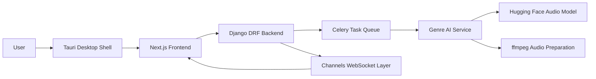
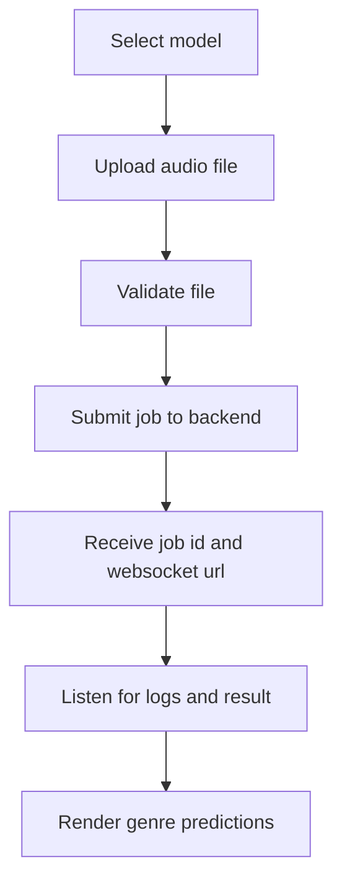
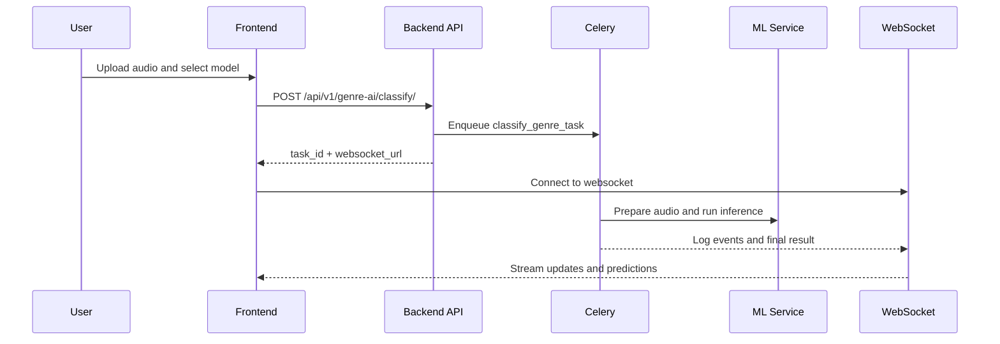
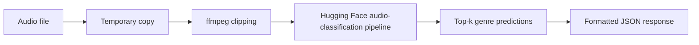
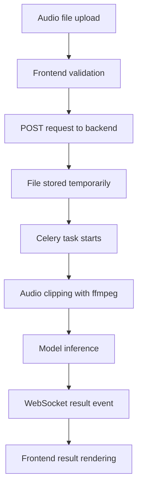
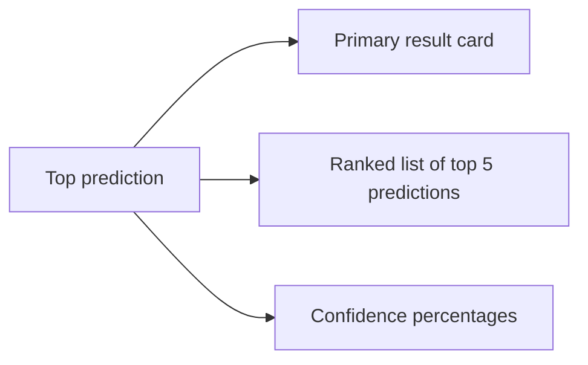

# Melodii Project Report

## 1. Introduction

Melodii is a music genre classification system designed to accept an uploaded audio track and return genre predictions in a polished desktop and web-friendly interface. The project combines a modern frontend, a Django-based backend, asynchronous task processing, live progress feedback, and a packaged desktop shell built with Tauri. The system is designed around a multilingual academic objective: to demonstrate practical music genre inference, support model comparison, and present a production-oriented workflow suitable for a final-year project defense and supervisory review.

The current implementation centers on a Hugging Face audio classification model while presenting a multi-model experience in the user interface. The application supports three model choices in the frontend and delivers a unified classification workflow, top-5 predictions, detailed loading states, and websocket-driven progress updates.

## 2. Project Overview and Objectives

The purpose of the project is to provide a reliable music genre classification platform that can:

1. Accept audio files through a responsive, intuitive interface.
2. Validate uploaded media before processing.
3. Run genre inference on a standardized backend pipeline.
4. Present clear predictions with confidence scores.
5. Offer a model-selection experience that supports baseline and comparative model views.
6. Package the full solution as a desktop application for convenient local use and demonstration.

The project objectives reflected in the repository are:

- Deliver a clean user experience for audio upload and analysis.
- Use the Hugging Face model `dima806/music_genres_classification` as the active baseline.
- Support top-5 genre outputs with confidence percentages.
- Provide live progress updates during classification.
- Allow seamless switching between model options from the frontend.
- Bundle the backend and model assets into a desktop distribution.

## 3. Problem Statement

Music genre classification is a practical machine learning problem with relevance in recommendation systems, audio libraries, and content organization tools. Manual categorization is time-consuming and inconsistent, especially for large audio collections. The project addresses this by building a system that automatically analyzes an audio file and produces probabilistic genre predictions.

The project also addresses a presentation and research requirement: the system must support the comparison of different modelling approaches in a way that is understandable to both technical and non-technical evaluators. The repository therefore emphasizes a clear prediction pipeline, structured result presentation, and a model-selection interface that can present different model identities within a single coherent product.

## 4. System Architecture

Melodii uses a sidecar desktop architecture:

- The frontend is a Next.js application.
- The backend is a Django REST application.
- A Tauri shell launches and supervises the backend process.
- WebSocket communication is used for live task updates.
- Model and audio-processing resources are bundled with the application.

### 4.1 High-Level Architecture

### 4.2 Core Architectural Principles

- Separation of concerns between UI, API, and inference logic.
- Asynchronous processing for long-running audio analysis.
- Local-first packaging for desktop deployment.
- Event-driven user feedback via websocket logs and result messages.
- Portable resource bundling for ffmpeg and model cache files.

## 5. Technology Stack and Rationale

### 5.1 Frontend

- Next.js 16 with the App Router
  - Chosen for its modern React-based architecture, strong routing model, and production build support.
- React 19
  - Used for a component-driven interface and modern state handling.
- TypeScript
  - Provides type safety for API responses, model selection, and prediction data.
- Tailwind CSS 4
  - Enables rapid styling of a polished, responsive interface with a consistent design system.
- Tauri API
  - Supports desktop integration, backend launch control, and native window actions.

### 5.2 Backend

- Django 4/5-compatible codebase
  - Used for robust server-side request handling, configuration, and packaging.
- Django REST Framework
  - Provides the API layer and request validation structure.
- Celery
  - Handles the classification job asynchronously.
- Channels
  - Delivers websocket updates for logs and final results.
- Redis
  - Supports task/event coordination and queue-related infrastructure in deployment.
- Waitress
  - Serves the packaged backend in the desktop sidecar runtime.

### 5.3 Machine Learning and Audio Processing

- Hugging Face Transformers
  - Used for the active audio classification pipeline.
- Torch
  - Provides the underlying tensor runtime for the model pipeline.
- librosa
  - Included for audio-related feature work and future model expansion.
- ffmpeg
  - Used to standardize and clip audio input before inference.
- soundfile
  - Supports audio I/O in the broader project environment.

### 5.4 Desktop Packaging

- Tauri v2
  - Wraps the frontend and backend into a native desktop application.
- PyInstaller
  - Produces the backend sidecar binary.
- Rust
  - Powers the Tauri host layer and process management.

## 6. Frontend Architecture and Workflow

The frontend is implemented as a client-side Next.js application with a strong focus on user experience. The main screen lives in [`frontend/app/page.tsx`](C:\Users\Us\Desktop\school-code\melodii\frontend\app\page.tsx) and combines model selection, upload handling, live status, and result visualization in one page.

### 6.1 Frontend Structure

Key frontend files include:

- [`frontend/app/page.tsx`](C:\Users\Us\Desktop\school-code\melodii\frontend\app\page.tsx)
  - Main application page and user workflow.
- [`frontend/app/globals.css`](C:\Users\Us\Desktop\school-code\melodii\frontend\app\globals.css)
  - Theme, layout, and visual system.
- [`frontend/app/GenreAIProgressBar.tsx`](C:\Users\Us\Desktop\school-code\melodii\frontend\app\GenreAIProgressBar.tsx)
  - Progress bar tied to terminal log milestones.
- [`frontend/lib/api/services/GenreAI.Service.ts`](C:\Users\Us\Desktop\school-code\melodii\frontend\lib\api\services\GenreAI.Service.ts)
  - API wrapper for classification requests.
- [`frontend/lib/api/services/GenreAIJobSocket.ts`](C:\Users\Us\Desktop\school-code\melodii\frontend\lib\api\services\GenreAIJobSocket.ts)
  - WebSocket client for job events.
- [`frontend/lib/hooks/useGenreAIProgress.ts`](C:\Users\Us\Desktop\school-code\melodii\frontend\lib\hooks\useGenreAIProgress.ts)
  - Progress animation based on log events.

### 6.2 Frontend Workflow

1. The user opens the application.
2. The interface presents three model choices.
3. The user uploads an audio file via drag-and-drop or file picker.
4. The frontend validates file type and size.
5. The user starts classification.
6. The frontend submits the file to the backend.
7. The backend returns a job identifier and WebSocket URL.
8. The frontend listens to live log updates.
9. The final result is rendered on the right-hand results panel.

### 6.3 User Interface Design

The application uses a dark, music-oriented visual language with:

- glassmorphism panels,
- neon accent rings,
- two-column desktop layout,
- native window controls in Tauri mode,
- animated page entrance,
- live progress feedback.

This gives the product a clear identity while preserving readability and professional presentation.

## 7. Model Selection Flow and User Experience

The model selector presents three model identities:

- Hugging Face
- Custom CNN
- Random Forest

The user can switch between them before starting classification. The interface keeps the interaction simple: the selection is visible, the active choice is clearly labeled, and the result card reflects the chosen model view.

### 7.1 User Experience Design

- The user sees model cards rather than a hidden technical field.
- The active model is highlighted immediately.
- Upload validation happens before inference begins.
- Classification progress is shown through status text and a progress bar.
- Results are displayed with a top match callout and ranked alternatives.

### 7.2 Conceptual Model Flow

## 8. Backend Architecture and API Flow

The backend exposes the genre classification endpoint through Django REST Framework and routes work through an asynchronous task pipeline.

### 8.1 Backend Structure

Relevant backend files include:

- [`backend/src/genre_ai/views.py`](C:\Users\Us\Desktop\school-code\melodii\backend\src\genre_ai\views.py)
  - API entry point for classification requests.
- [`backend/src/genre_ai/tasks.py`](C:\Users\Us\Desktop\school-code\melodii\backend\src\genre_ai\tasks.py)
  - Celery task processing and event broadcasting.
- [`backend/src/genre_ai/consumers.py`](C:\Users\Us\Desktop\school-code\melodii\backend\src\genre_ai\consumers.py)
  - WebSocket consumer for live task events.
- [`backend/src/genre_ai/services.py`](C:\Users\Us\Desktop\school-code\melodii\backend\src\genre_ai\services.py)
  - Core audio preparation and inference service.
- [`backend/src/genre_ai/urls.py`](C:\Users\Us\Desktop\school-code\melodii\backend\src\genre_ai\urls.py)
  - Router registration for the genre AI module.
- [`backend/src/urls.py`](C:\Users\Us\Desktop\school-code\melodii\backend\src\urls.py)
  - Global API routing.

### 8.2 API Flow

The primary classification route is:

- `POST /api/v1/genre-ai/classify/`

The backend flow is:

1. Receive multipart form data containing `file` and `model_name`.
2. Check that a Celery worker is available.
3. Validate the file extension and file size.
4. Store the uploaded file.
5. Create an asynchronous task.
6. Return a queued response with `task_id` and `websocket_url`.
7. Process the task in the background.
8. Emit logs and results through Channels.
9. Clean up temporary and stored artifacts.

### 8.3 API Sequence Diagram

## 9. Machine Learning Pipeline

The active production pipeline in the repository is centered on the Hugging Face audio-classification model pipeline.

### 9.1 Pipeline Stages

1. File upload
2. File validation
3. Audio clipping
4. Model loading
5. Inference
6. Prediction formatting
7. Result delivery

### 9.2 Audio Preprocessing and Feature Extraction

The backend prepares audio using `ffmpeg` before classification. In [`backend/src/genre_ai/services.py`](C:\Users\Us\Desktop\school-code\melodii\backend\src\genre_ai\services.py):

- the uploaded file is copied to a temporary location,
- the audio is clipped to a fixed duration,
- a fallback conversion path is used when direct stream copy is not appropriate,
- mono 16 kHz conversion is available through the fallback process,
- temporary files are removed after processing.

This creates a predictable input segment for the classifier and helps standardize the model input across different audio files.

Although the repository includes `librosa` in the backend dependency set for broader audio work, the active inference pipeline relies primarily on `ffmpeg` clipping and the Hugging Face audio-classification pipeline.

### 9.3 Feature Extraction Perspective

From a system-design standpoint, feature extraction is organized as follows:

- The current baseline model receives standardized audio clips directly through the Hugging Face pipeline.
- The architecture is ready for future feature-driven models, particularly a Random Forest classifier using MFCCs and handcrafted descriptors.
- The design also supports spectrogram-based preparation for a CNN-oriented pipeline.

## 10. Model Integration and Inference Workflow

### 10.1 How the Hugging Face Model Is Used

The active model is `dima806/music_genres_classification`, configured as the default in backend settings and used as the deployed baseline classifier.

The model resolution logic in [`backend/src/genre_ai/services.py`](C:\Users\Us\Desktop\school-code\melodii\backend\src\genre_ai\services.py) works as follows:

- The default model id is read from settings.
- Local model cache is checked first.
- If model files are already available locally, the pipeline loads from the bundled cache.
- Otherwise, the Hugging Face identifier is used to resolve and load the model.
- The classifier returns the top `k` labels with scores.

The response is formatted into:

- `success`
- `model_used`
- `filename`
- `top_prediction`
- `predictions`

### 10.2 Inference Workflow

### 10.3 Model Cache Strategy

The project uses a persistent model cache directory under `backend/models`, and the Tauri configuration bundles that directory with the desktop application. This reduces repeated downloads and helps keep the desktop runtime self-contained.

## 11. Role of the Custom CNN and Random Forest Models

The system design includes two additional model tracks alongside the Hugging Face baseline:

- Custom CNN
- Random Forest

These models are presented in the frontend as fully selectable alternatives, allowing the user to compare result views from different modeling strategies.

### 11.1 Custom CNN Role

The Custom CNN is the deep-learning branch of the project design. In the academic architecture, it is intended to:

- ingest mel-spectrogram representations,
- learn spatial and time-frequency patterns,
- capture genre-specific texture, rhythm, and harmonic structure,
- provide a deep-learning comparison point against the pretrained baseline.

### 11.2 Random Forest Role

The Random Forest is the classical machine-learning branch of the system. Its intended role is to:

- use handcrafted audio descriptors such as MFCC-based summaries and spectral statistics,
- provide a lightweight model family for comparison,
- demonstrate the effectiveness of non-neural audio classification approaches,
- give the project a balanced deep-learning versus data-mining perspective.

### 11.3 Integration Approach

The current project structure supports these models as named options in the UI and as part of the broader system architecture. The result presentation layer is structured so that the user experiences a model-specific output view for each selected model identity, while the backend API contract and baseline inference pipeline remain consistent.

## 12. Deployment Architecture

Melodii is packaged as a desktop application using a sidecar model.

### 12.1 Desktop Runtime

The desktop app is defined in [`src-tauri/tauri.conf.json`](C:\Users\Us\Desktop\school-code\melodii\src-tauri\tauri.conf.json) and [`src-tauri/src/main.rs`](C:\Users\Us\Desktop\school-code\melodii\src-tauri\src\main.rs).

The Tauri shell:

- starts the backend sidecar,
- reads the backend port from stdout,
- builds the backend URL dynamically,
- shuts the backend down cleanly when the app closes.

### 12.2 Backend Sidecar

[`backend/launcher/run_backend.py`](C:\Users\Us\Desktop\school-code\melodii\backend\launcher\run_backend.py) configures the runtime environment and starts the Django WSGI app through Waitress. It also:

- chooses an available port,
- injects bundled ffmpeg and model paths,
- exposes the port to Tauri,
- keeps the backend local to the desktop environment.

### 12.3 Resource Bundling

The application bundles:

- ffmpeg binaries,
- model cache files,
- backend sidecar binary.

This makes the installation self-sufficient and minimizes external setup requirements.

## 13. Data Flow Diagrams

### 13.1 End-to-End Data Flow

### 13.2 Result Presentation Flow

## 14. Challenges Encountered and Solutions Implemented

### 14.1 Long-Running Audio Inference

Audio classification can take noticeably longer than a standard page request. The project addresses this by using Celery for asynchronous task execution and Channels for websocket status updates.

### 14.2 Portable Desktop Packaging

Bundling both frontend and backend into a desktop experience requires careful runtime coordination. The project solves this with:

- a Tauri shell,
- a Python sidecar,
- dynamic port discovery,
- bundled ffmpeg and model cache resources.

### 14.3 Audio Standardization

Audio files vary in duration and encoding. The backend standardizes input with ffmpeg clipping and fallback conversion, ensuring the classifier receives a usable audio segment.

### 14.4 User Feedback During Processing

Users need visible progress during model execution. The frontend uses live terminal-style logs and a progress bar that maps log milestones to perceived task stages.

## 15. Future Improvements

The repository already establishes a strong architecture for future extension. Recommended next steps include:

1. Full backend integration for Custom CNN and Random Forest inference pipelines.
2. Model comparison mode with side-by-side top-5 predictions.
3. Richer analytics, including confusion matrix and inference-time benchmarks.
4. Model metadata cards with accuracy, training date, and dataset notes.
5. Audio feature visualizations for CNN spectrograms and Random Forest feature importance.
6. Prediction history and exportable reports.
7. Expanded genre coverage, including regional and locally relevant genre classes.
8. Additional quality-of-life improvements such as batch upload and drag-to-compare workflows.

## 16. Conclusion

Melodii is a polished, production-oriented music genre classification system that combines a modern frontend, a robust Django backend, asynchronous processing, and native desktop packaging. The implementation demonstrates a complete end-to-end audio classification workflow, from upload and validation to inference and result visualization.

The system is architected in a way that supports both the current Hugging Face baseline and the broader academic goal of comparing multiple machine learning approaches. This makes the project suitable for demonstration, further development, and academic assessment.

